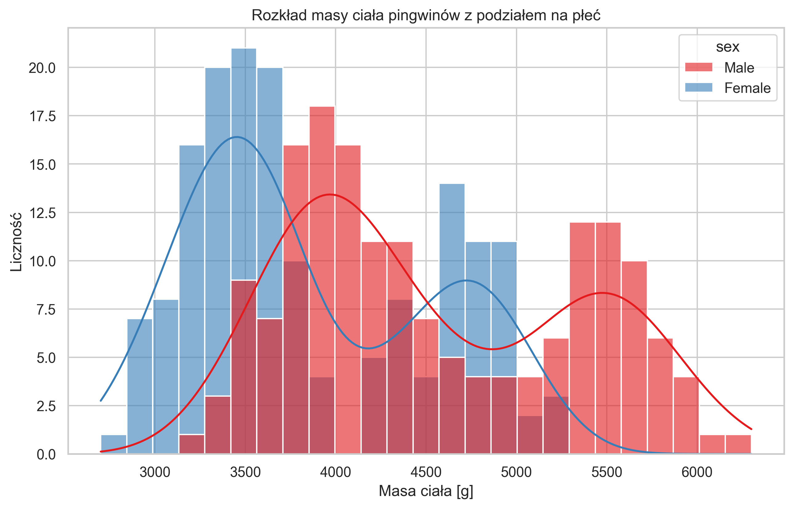
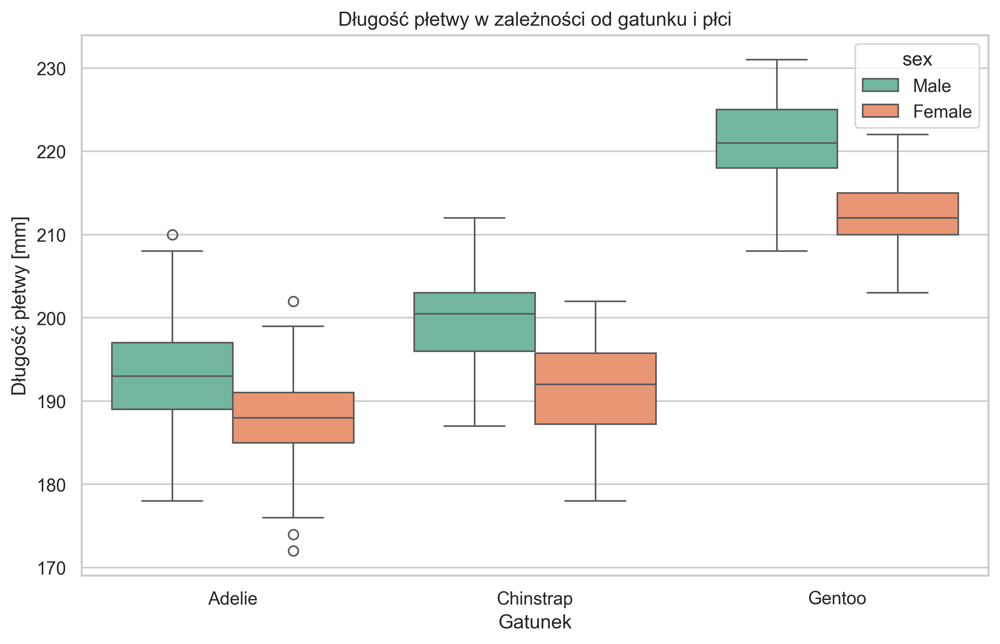
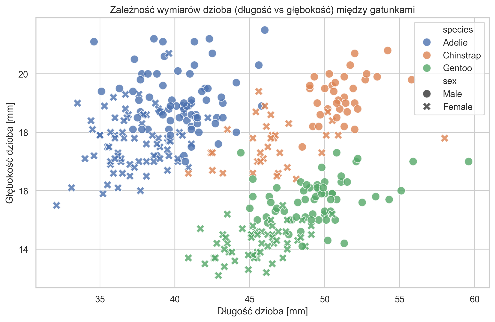

# Metody planowania i analizy eksperymentów - Analiza opisowa wybranych danych (zadanie domowe nr 1)

## 1. Informacja na temat wybranych danych

Zbiór danych **Palmer Penguins** jest często wykorzystywany jako alternatywa dla klasycznego zbioru Iris. Dane zostały zebrane i udostępnione przez dr Kristen Gorman oraz stację badawczą Palmer Station, Antarktyda (w ramach Long Term Ecological Research Network). 

Zbiór ten pozwala przeanalizować zależności między cechami fizycznymi pingwinów z uwzględnieniem podziału na ich płeć i gatunek. Dane zostały wstępnie oczyszczone, usunięto z nich wiersze z brakującymi rekordami (metodą `dropna`), aby uniknąć błędów agregacji.

**Opis poszczególnych cech (zmiennych):**

* **Gatunek (species)** - zmienna grupująca przypisująca pingwina do jednego z trzech gatunków: *Adelie, Chinstrap, Gentoo*.

* **Płeć (sex)** - zmienna grupująca: *male* (samiec), *female* (samica). Zmienna ta jest wprost powiązana z naturalnym dymorfizmem płciowym badanej grupy.

* **Wyspa (island)** - *Biscoe, Dream, Torgersen* (miejsce na archipelagu Palmera, gdzie badano danego osobnika).

* **Masa ciała (body_mass_g)** - waga danego osobnika obserwowana w gramach.

* **Wymiary fizyczne** - zmienne podane w milimetrach:

  * `flipper_length_mm` - długość płetwy.

  * `bill_length_mm` - długość dzioba.

  * `bill_depth_mm` - głębokość (grubość) dzioba.

## 2. Wykorzystane narzędzia

Do wczytania, odpowiedniego wyczyszczenia z braków danych w niektórych zmiennych, oraz ich grupowego przetworzenia wykorzystano szeroko pojęte środowisko **Python** oraz dedykowane, popularne pakiety deweloperskie (biblioteki) przeznaczone do tego rodzaju analizy:

* **`pandas`** - fundamentalny pakiet pozwalający wczytać zbiór jako `DataFrame`, a także dokonać agregacji korzystając z metody okienkowej `groupby()` (obliczanie statystyk dla każdej grupy) ze wsparciem statystycznego `describe()`.

* **`matplotlib.pyplot`** oraz **`seaborn`** - są to biblioteki służące do wizualizacji danych. Wykorzystano między innymi wizualizację rozkładów danych dla różnych grup z wykorzystaniem obiektów: histogramu (`histplot`), wykresu dyspersyjnego (`scatterplot`) oraz klasycznego wykresu pudełko-wąsy (`boxplot`).

## 3. Wskaźniki sumaryczne

Podstawą tego badania było potraktowanie masy ciała (`body_mass_g`) jako zmiennej zależnej, natomiast dla analizy porównawczej uwzględniono tu koniunkcję dwóch kluczowych zmiennych grupujących (cech jakościowych): **płci (sex)** oraz **gatunku (species)**.

Tabela: Statystyki sumaryczne dla **masy ciała (body_mass_g)** w gramach.

| Gatunek (species) | Płeć (sex) | Liczebność całkowita | Średnia masa (mean) | Mediana (median) | Odch. stand. (std) |
|-------------------|------------|----------------------|---------------------|------------------|--------------------|
| Adelie            | Female     | 73                   | 3368.84             | 3400.0           | 269.38             |
| Adelie            | Male       | 73                   | 4043.49             | 4000.0           | 346.81             |
| Chinstrap         | Female     | 34                   | 3527.21             | 3550.0           | 285.33             |
| Chinstrap         | Male       | 34                   | 3938.97             | 3950.0           | 362.14             |
| Gentoo            | Female     | 58                   | 4679.74             | 4700.0           | 281.58             |
| Gentoo            | Male       | 61                   | 5484.84             | 5500.0           | 313.16             |

## 4. Wyniki wizualne (wykresy)
Przedstawiono wizualizacje przedstawiające rozkłady danych wg zmiennych grupujących. Poniższe wykresy pozwalają nie tylko zaobserwować zależności, ale również pomagają zweryfikować badawczą klasyfikację różnych gatunków.

### A. Rozkład masy ciała z badaniem płci

### B. Różnice fizjologiczne względem grup

Wykres typu "Boxplot", przedstawiający kwartyle dla długości płetwy, potwierdza wyraźne różnice między grupami pingwinów (co jest również skorelowane z masą ciała). Szczególnie dobrze widoczne jest to dla gatunku Gentoo, którego nawet samice - na ogół lżejsze z mniejszymi płetwami - są istotnie większe i cięższe od innych gatunków.

### C. Analiza wymiarów dzioba dla poszczególnych gatunków
Wykres punktowy (scatter plot) pokazujący korelację między długością a głębokością dzioba. Widać tu wyraźne zgrupowania (klastry) odpowiadające poszczególnym gatunkom, co sugeruje, że te cechy są dobrymi predyktorami do klasyfikacji pingwinów.

## 5. Interpretacja poszczególnych wyników - wnioski

Analiza powyższych danych dotyczących pingwinów pozwala na wyciągnięcie kilku kluczowych wniosków:

1. **Widoczny dymorfizm płciowy**: Statystyki jasno pokazują, że samce (niezależnie od tego, o jakim gatunku mówimy) są wyraźnie większe i cięższe od samic. Przeciętny samiec jest o około 500-800 gramów cięższy i ma zauważalnie dłuższą płetwę. Na histogramie widać wyraźne przesunięcie rozkładów masy dla obu płci.

2. **Cechy gatunku nadpisywane przez płeć**: Gatunek **Gentoo** wyraźnie wyróżnia się pod względem wielkości. Nawet samice z grupy Gentoo są na ogół zauważalnie cięższe, a ich płetwy są dłuższe (mediana to ok. 210~215 mm) niż wskaźniki najcięższych w stawce i dobrze zbudowanych samców z grup **Adelie** i **Chinstrap**. 

3. **Bardzo silne zgrupowania klastrowe wymiarów dzioba (Scatter Plot)**: Korelacja wymiarów dzioba jest dobrą cechą do rozróżnienia i bardzo trafną zmienną do klasyfikacji gatunków. Jak wynika z wykresu rozrzutu, pomiar zaledwie dwóch cech - długości oraz głębokości dzioba - pozwala na niemal całkowitą separację gatunków. Tworzą one trzy wyraźne klastry, co sugeruje, że parametry te są wystarczające do budowy skutecznego modelu klasyfikacyjnego bez konieczności wykonywania kosztownych badań genetycznych.

  
<b>Autor:</b> Aleksander Stepaniuk 272644

