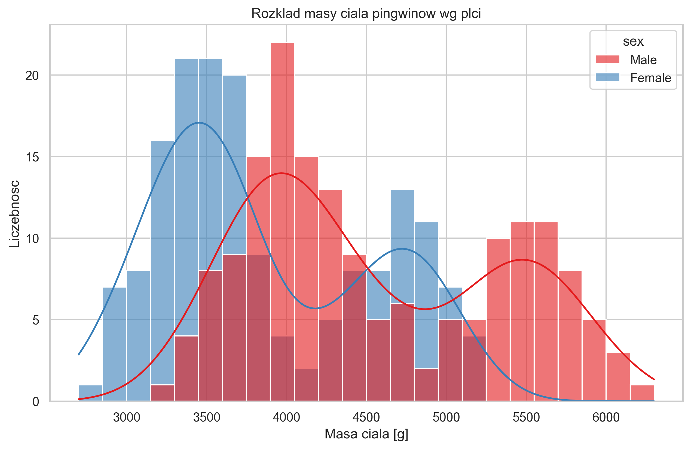
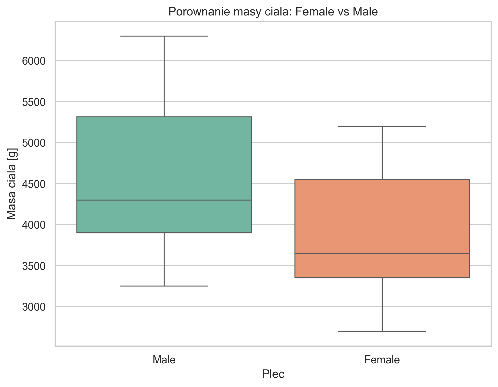

# Metody planowania i analizy eksperymentów - Wnioskowanie statystyczne (zadanie domowe nr 2)

## 1. Informacja na temat wybranych danych

Poniższy raport jest kontynuacją zadania pierwszego, wykorzystano ten sam zbiór danych **Palmer Penguins** (pingwiny z rejonu Palmer Station, Antarktyda), ale tym razem nacisk położono na wnioskowanie statystyczne, a nie tylko analizę opisową.

**Opis poszczególnych cech (zmiennych):**

* **Gatunek (species)** - zmienna grupująca przypisująca pingwina do jednego z trzech gatunków: *Adelie, Chinstrap, Gentoo*.

* **Płeć (sex)** - zmienna grupująca: *male* (samiec), *female* (samica). Zmienna ta jest wprost powiązana z naturalnym dymorfizmem płciowym badanej grupy.

* **Wyspa (island)** - *Biscoe, Dream, Torgersen* (miejsce na archipelagu Palmera, gdzie badano danego osobnika).

* **Masa ciała (body_mass_g)** - waga danego osobnika obserwowana w gramach.

* **Wymiary fizyczne** - zmienne podane w milimetrach (flipper_length_mm, bill_length_mm, bill_depth_mm).

W analizie skoncentrowano się na:

* zmiennej ilościowej **body_mass_g** (masa ciała w gramach),
* zmiennej grupującej **sex** (Female, Male),
* porównaniu dwóch *niezależnych* populacji: samice vs samce.

Dane oczyszczono z braków dla zmiennych **sex** i **body_mass_g** (korzystając z `dropna`). Po czyszczeniu otrzymano:

* Female: **165** obserwacji,
* Male: **168** obserwacji.

## 2. Wykorzystane narzędzia

Do wczytania, odpowiedniego wyczyszczenia z braków danych w niektórych zmiennych, oraz ich grupowego przetworzenia wykorzystano szeroko pojęte środowisko **Python** oraz dedykowane, popularne pakiety deweloperskie (biblioteki) przeznaczone do tego rodzaju analizy:

* **`pandas`**: `read_csv`, `dropna`, `groupby`, `agg` - wczytanie danych i estymacja punktowa.
* **`numpy`**: `mean`, `var`, `sqrt` - obliczenia numeryczne pomocnicze.
* **`scipy.stats`**:
	* `sem` oraz `t.ppf` - konstrukcja 95% przedziałów ufności,
	* `ttest_ind(..., equal_var=False)` - test t-Welcha dla dwóch niezależnych prób.
* **`seaborn` + `matplotlib`**: `histplot`, `boxplot` - wizualizacja rozkładów.

## 3. Model statystyczny i założenia

### 3.1. Model statystyczny

W analizie stosuje się model **dwóch niezależnych populacji** o następujących właściwościach:

* **Populacja 1 (Female):** $X_1 \sim F_1(\mu_1, \sigma_1^2)$
* **Populacja 2 (Male):** $X_2 \sim F_2(\mu_2, \sigma_2^2)$

gdzie:
* $\mu_1, \mu_2$ – **średnie masy ciała w populacjach** (nieznane),
* $\sigma_1^2, \sigma_2^2$ – **wariancje populacji** (nieznane).

**Uzasadnienie wyboru modelu:**
* populacje (samice i samce) są niezależne i reprezentują różne grupy biologiczne,
* średnie i wariancje populacji nie są znane i muszą być estymowane z próby,
* liczebności prób (Female: 165, Male: 168) są wystarczające do zastosowania testów parametrycznych.

### 3.2. Sprawdzenie założenia normalności

Normalność rozkładu zmiennej `body_mass_g` w obu grupach badano za pomocą **testu Shapiro-Wilka**.

**Hipotezy testu:**
* $H_0$: zmienna ma rozkład normalny,
* $H_1$: zmienna nie ma rozkładu normalnego.

Wyniki:

| Grupa | n | Statystyka | p-value | Decyzja (α=0.05) |
|---|---:|---:|---:|---|
| Female | 165 | 0.9193 | < 0.00000001 | Odrzucamy H₀ |
| Male | 168 | 0.9250 | < 0.00000001 | Odrzucamy H₀ |

**Interpretacja:** W obu grupach wartości p-value są znacznie mniejsze niż α = 0.05, co prowadzi do odrzucenia hipotezy o normalności rozkładu masy ciała. Oznacza to, że rozkład `body_mass_g` **nie ma rozkładu normalnego** ani w grupie samic, ani w grupie samców.

**Implikacje dla analizy:** Pomimo naruszenia założenia normalności, test t-Welcha jest stosunkowo odporny na odchylenia od normalności dla większych prób (Central Limit Theorem). Ze względu na liczebności próby (n > 100 w obu grupach) oraz symetryczne rozkłady (co widać na histogramach), test t-Welcha pozostaje uzasadniony, choć można byłoby również zastosować test nieparametryczny (Mann-Whitney'a).

## 4. Wyniki

Wymagane metody wnioskowania zastosowano dla zmiennej **body_mass_g**.

### 4.1. Estymacja punktowa

Tabela: statystyki punktowe masy ciała w grupach płci.

| Płeć | Liczebność | Średnia [g] | Mediana [g] | Odch. stand. [g] |
|---|---:|---:|---:|---:|
| Female | 165 | 3862.27 | 3650.0 | 666.17 |
| Male | 168 | 4545.68 | 4300.0 | 787.63 |

* średnia ogółem: **4207.06 g**,
* estymator różnicy średnich (Male - Female): **683.41 g**.

### 4.2. Estymacja przedziałowa (95% CI)

Przedziały konstruowano na podstawie rozkładu t-Studenta.

$$
CI_{95\%}(\mu)=\bar{x}\pm t_{0.975,\,n-1}\cdot\frac{s}{\sqrt{n}}
$$

oraz dla różnicy średnich (wariant Welcha):

$$
CI_{95\%}(\mu_{Male}-\mu_{Female})=\hat{\Delta}\pm t_{0.975,\,\nu}\cdot SE(\hat{\Delta})
$$

| Parametr | Estymator | CI95 dół | CI95 góra |
|---|---:|---:|---:|
| Średnia masa ciała (ogółem) | 4207.06 | 4120.26 | 4293.86 |
| Średnia masa ciała (Female) | 3862.27 | 3759.87 | 3964.67 |
| Średnia masa ciała (Male) | 4545.68 | 4425.71 | 4665.65 |
| Różnica średnich (Male - Female) | 683.41 | 526.25 | 840.58 |

Ważna obserwacja: przedział dla różnicy średnich nie zawiera 0.

### 4.3. Weryfikacja hipotezy statystycznej

Przeprowadzono **dwustronny test t-Welcha** dla dwóch niezależnych populacji.

* $H_0$: $\mu_{Male}=\mu_{Female}$,
* $H_1$: $\mu_{Male}\neq\mu_{Female}$,
* poziom istotności: $\alpha=0.05$.

Wyniki testu:

* statystyka: $t=8.5545$,
* stopnie swobody (Welch): $df=323.90$,
* $p$-value: **< 0.00000001**.

Ponieważ $p<\alpha$, **odrzucamy $H_0$**.

## 5. Wizualizacja rozkładów

Histogram potwierdza przesunięcie rozkładu masy ciała w prawo dla grupy Male, a boxplot pokazuje wyższą medianę i kwartyle w tej grupie.

## 6. Interpretacja wyników i wnioski

1. **Wniosek o średnich**: samce są średnio cięższe od samic o około **683 g**, co jest różnicą dużą z punktu widzenia praktycznego.
2. **Wniosek przedziałowy**: z 95% pewnością rzeczywista różnica średnich (Male - Female) mieści się w zakresie **od 526.25 g do 840.58 g**.
3. **Wniosek testowy**: bardzo małe $p$-value prowadzi do odrzucenia hipotezy o równości średnich, czyli różnica nie jest przypadkowa statystycznie.
4. **Spójność z biologią**: wyniki są zgodne z oczekiwanym dymorfizmem płciowym u pingwinów i potwierdzają obserwacje z zadania 1 na poziomie inferencyjnym.

	
<b>Autor:</b> Aleksander Stepaniuk 272644

